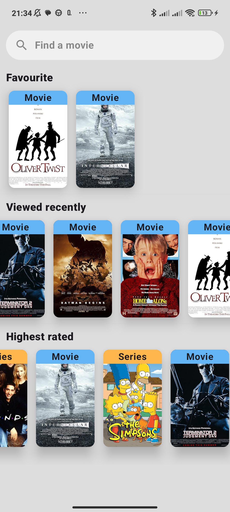
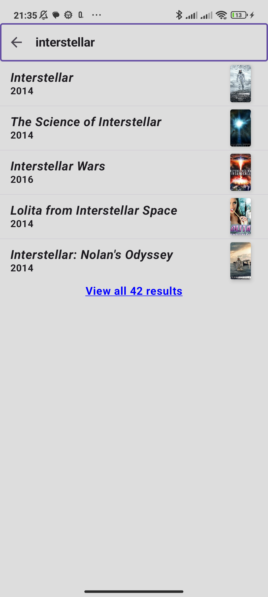
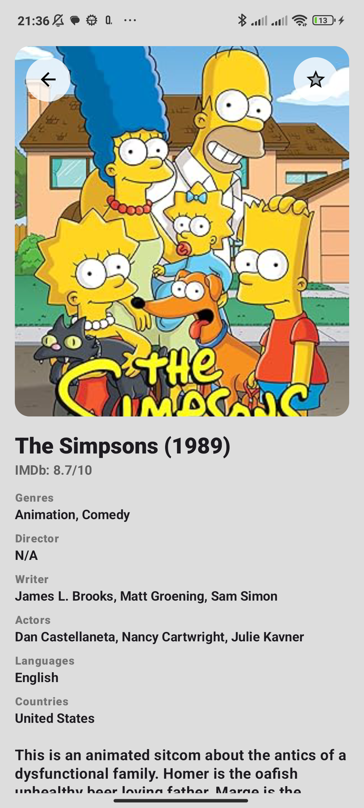
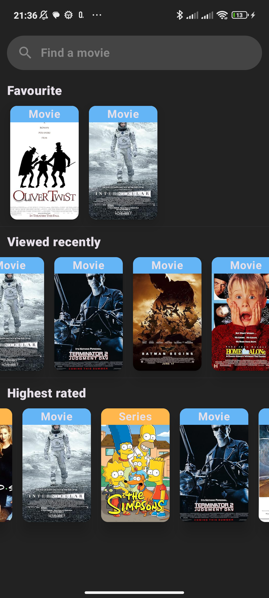
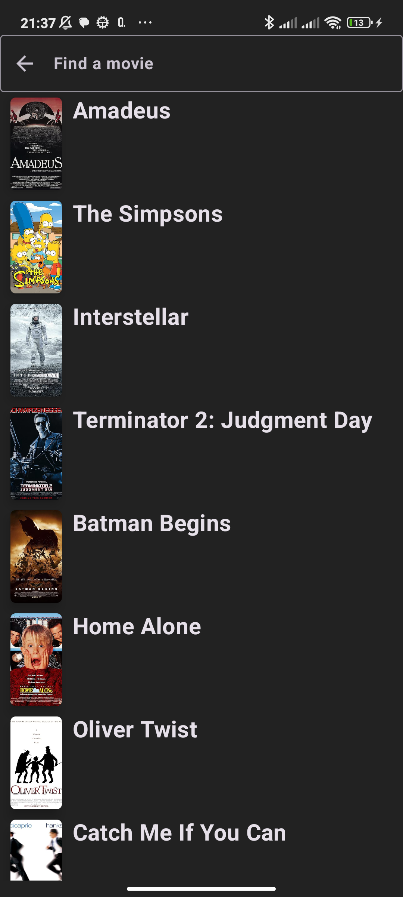

# Movie Explorer App

A modern **movie browsing** app built with **Jetpack Compose** that allows users to explore top-rated films, search by title, and manage their favorites – all with local persistence.

---

## Features 🎬

- **Search** movies by title
- **Mark favorites** and access them anytime
- Automatically **track recently viewed movies**
- **Local persistence** using Room database

---

## Screenshots 📱

| Main Screen | Search Screen | Details Screen |
| ----------- | ------------- | -------------- |
|  |  |  |
|  |  |  |

---

## Demo 🎥

---

## Tech Stack 🛠️

- **Kotlin**
- **Jetpack Compose**
- **Material 3**
- **Room** – for favorites and history
- **Retrofit** – for API integration (https://www.omdbapi.com/)
- **Navigation**
- **Coroutines**

---

## License 📄

This project is licensed under the **MIT License** – see the [LICENSE](LICENSE) file for details.

---

## Contact 📫

For any inquiries or feedback, feel free to contact me:

- **LinkedIn:** [Marek Storek](https://www.linkedin.com/in/marekstorek)
- **Email:** marek.storek1@gmail.com
